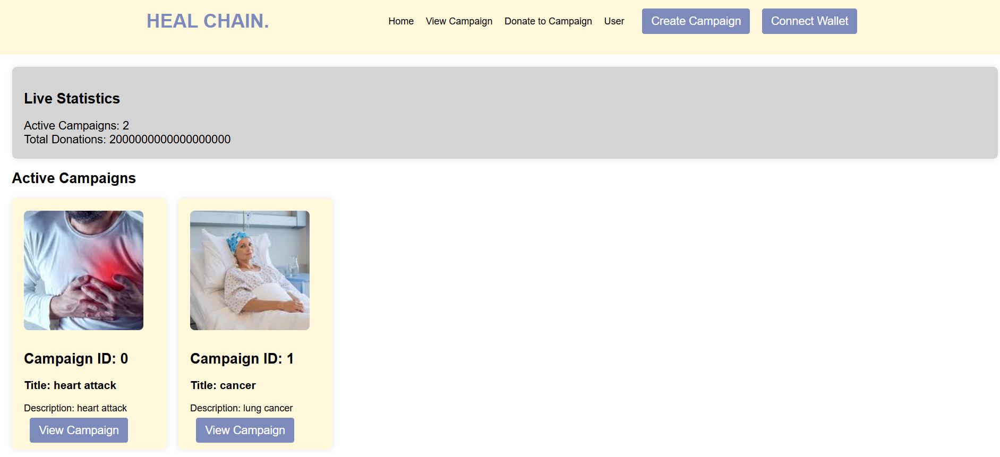
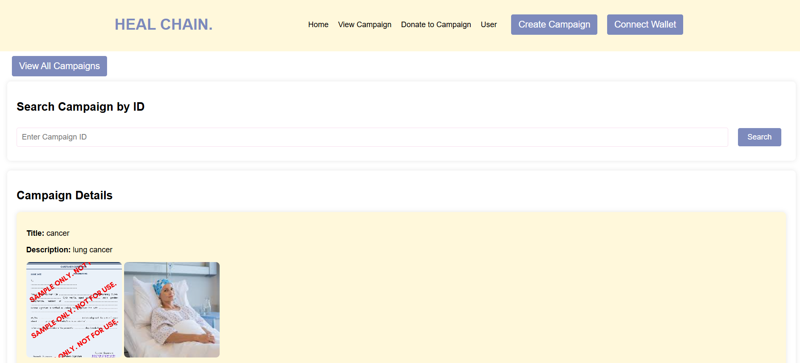
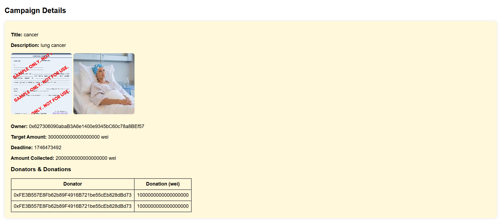
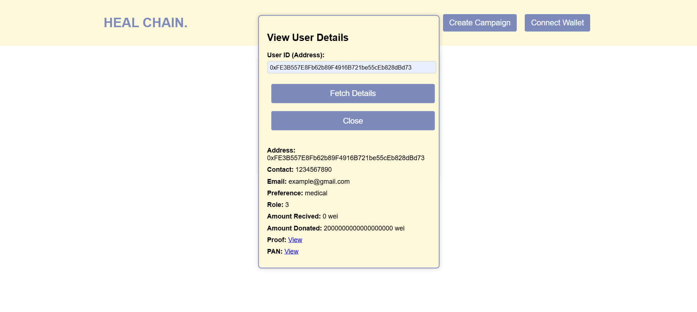
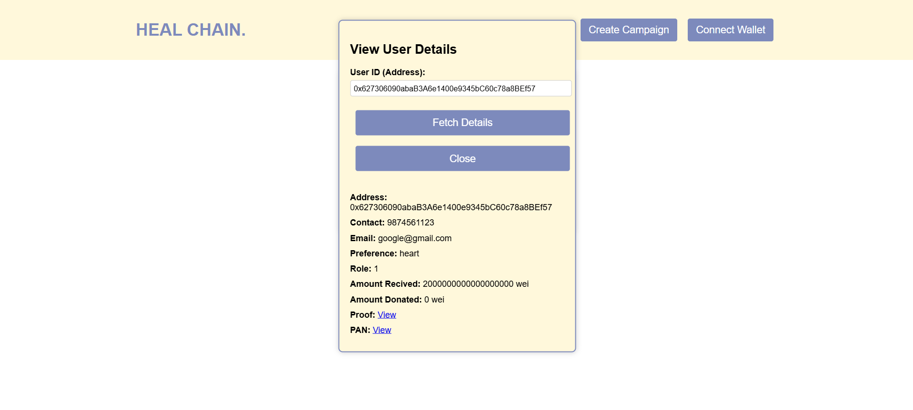

# 💊 HealChain
HealChain is a decentralized crowdfunding platform focused on supporting medical campaigns. Built on a public blockchain network using **Hyperledger Besu with IBFT 2.0**, HealChain ensures transparency, security, and trust for donors and campaign creators alike.

## 🚀 Key Features
- 🔗 **Decentralized**: No central authority — campaigns are managed on-chain.
- 🏥 **Medical-Focused**: Specifically designed for medical needs and emergencies.
- ⚡ **Gas-Free Transactions**: Users can interact with the platform without worrying about gas fees.
- 🔐 **Public Blockchain**: Anyone can view, verify, and interact with campaigns.
- 🛠️ **Built with Hyperledger Besu**: Utilizes the IBFT 2.0 consensus algorithm for fast and secure block finality.

## 🛠️ Tech Stack
- **Blockchain**: Hyperledger Besu (IBFT 2.0)
- **Smart Contracts**: Solidity
- **Frontend**: Flask

## ⚙️ How to Set Up
1. **Blockchain Network Setup**  
   Follow the instructions in [`Blockchain_Network_Setup.md`](Blockchain_Network_Setup.md) to configure the Hyperledger Besu network with IBFT 2.0.
2. **Deploy Smart Contracts**  
   Refer to [`Smart_Contract_Deployment.md`](Smart_Contract_Deployment.md) to compile and deploy the smart contracts.
3. **Frontend Configuration**
   - Navigate to the `ui/static/js/` folder.
   - Open [`script.js`](ui/static/js/script.js) and update the following lines:
     - **Line 4**: Replace with your deployed **contract address**  
     - **Line 5**: Replace with your **contract ABI**
     - **Line 12**: Replace with the **IP address** of your blockchain network
4. **Run the Flask App**
   - From the `ui` directory, run:
     ```bash
     python app.py
     ```
   - Open your browser and interact with HealChain through the frontend!

## 📸 Demo
### All Campaigns Page


### View Campaign Details Page



### View User Details Page



## Contributors
<table align="center" style="border: none;">
<tr>
<td align="center" width="200"><pre><a href="https://github.com/CS-Amritha"><br><sub>@CS-Amritha</sub></a></pre></td>
<td align="center" width="200"><pre><a href="https://github.com/Anaswara-Suresh"><br><sub>@Anaswara-Suresh</sub></a></pre></td>
<td align="center" width="200"><pre><a href="https://github.com/AmalRitessh"><br><sub>@AmalRitessh</sub></a></pre></td>
</tr>
</table>
